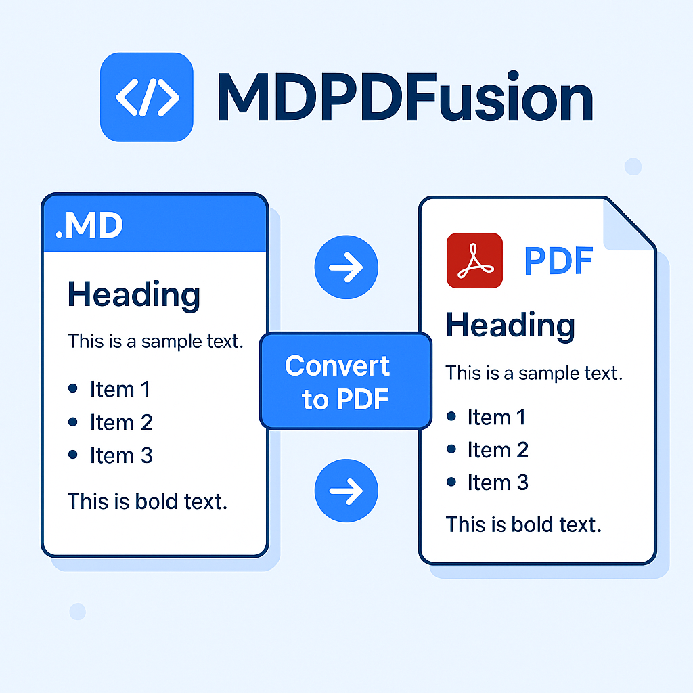

# MDPDFusion

<p align="center">
  
</p>

MDPDFusion es una aplicación de Streamlit que permite a los usuarios convertir múltiples archivos Markdown (.md) a PDF de manera sencilla y eficiente.

## Características

- Interfaz gráfica intuitiva construida con Streamlit
- Soporte para la carga de múltiples archivos .md
- Conversión rápida de Markdown a PDF
- Descarga inmediata de los archivos PDF generados

## Requisitos

- Python 3.10+
- Streamlit
- Markdown
- PyPandoc
- ReportLab

## Configuración del entorno virtual

### Windows

1. Abre una terminal (CMD o PowerShell)
2. Navega hasta la carpeta del proyecto:
   ```
   cd ruta\a\MDPDFusion
   ```
3. Crea un entorno virtual:
   ```
   python -m venv venv
   ```
4. Activa el entorno virtual:
   ```
   venv\Scripts\activate
   ```
5. Actualiza pip e instala las dependencias:
   ```
   python -m pip install --upgrade pip
   pip install -r requirements.txt
   ```

### macOS / Linux

1. Abre una terminal
2. Navega hasta la carpeta del proyecto:
   ```
   cd ruta/a/MDPDFusion
   ```
3. Crea un entorno virtual:
   ```
   python3 -m venv venv
   ```
4. Activa el entorno virtual:
   ```
   source venv/bin/activate
   ```
5. Actualiza pip e instala las dependencias:
   ```
   python -m pip install --upgrade pip
   pip install -r requirements.txt
   ```

## Instalación

1. Clona este repositorio:
   ```
   git clone https://github.com/bladealex9848/MDPDFusion.git
   cd MDPDFusion
   ```

2. Sigue los pasos de configuración del entorno virtual según tu sistema operativo.

## Uso

1. Asegúrate de que el entorno virtual esté activado.

2. Ejecuta la aplicación:
   ```
   streamlit run mdpdfusion.py
   ```

3. Abre tu navegador y ve a `http://localhost:8501`

4. Sube tus archivos .md usando el botón de carga de archivos

5. Haz clic en los botones de descarga para obtener tus archivos PDF convertidos

## Contribuir

Las contribuciones son bienvenidas. Por favor, abre un issue para discutir cambios mayores antes de enviar un pull request.

## Licencia

Este proyecto está bajo la licencia MIT. Ver el archivo `LICENSE` para más detalles.
